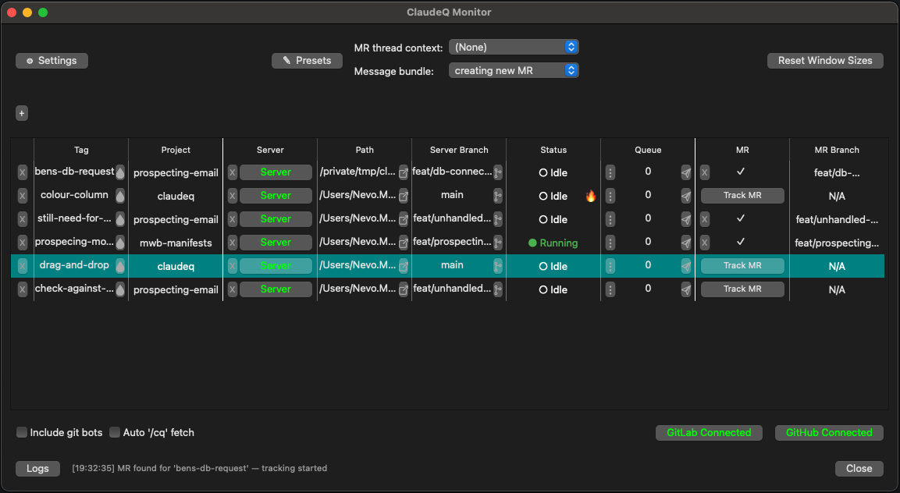

# ClaudeQ

**Multi-session Claude Code with message queueing and image support — works perfectly in IntelliJ and VS Code with native scrolling!**

Queue multiple prompts with images in one terminal while Claude works in another. Auto-sends queued messages when ready for a seamless workflow.

## Key Features

- **Smart message queueing** — Auto-sends when Claude is ready
- **Real-time GUI monitoring** — See all sessions, jump across IDEs and projects
- **MR/PR tracking** — GitLab & GitHub thread detection with `/cq` command support
- **Slack integration** — Bidirectional messaging between Slack and CQ sessions
- **Image support** — Paste clipboard images directly into messages

## How It Works

ClaudeQ uses a **PTY-based client-server model**:

1. **Terminal 1 (Server)**: `cq my-feature` → Starts Claude with scrolling
2. **Terminal 2 (Client)**: `cq my-feature` → Interactive client for queueing messages

**Note:** Only one client can connect to a server at a time

The same command auto-detects whether to start a server or connect as a client based on socket existence.

## Platform Compatibility

**macOS**: Full support (all features)
**Linux**: Core features work (queueing, auto-send). Image support and monitor navigation require adaptation.
**Windows**: Not supported (PTY/Unix sockets incompatible)

## Installation

**Prerequisites:** Python 3.8+, Node.js, macOS

```bash
# 1. Install Claude CLI (required)
npm install -g @anthropic-ai/claude-code

# 2. Clone and install ClaudeQ
git clone https://github.com/nevo24/claudeq.git
cd claudeq
make install

# 3. Reload shell
source ~/.zshrc  # or ~/.bashrc for bash
```

`make install` installs the core system and then **prompts you** to optionally install:
- **Monitor GUI** — native macOS app for session management (default: Yes)
- **Slack Integration** — bidirectional Slack ↔ CQ messaging (default: No)

You can install or uninstall these components individually at any time:

```bash
make install-monitor       # Install Monitor GUI
make uninstall-monitor     # Remove Monitor GUI

make install-slack-app     # Install Slack integration
make uninstall-slack-app   # Remove Slack integration
```

## Updating

```bash
claudeq --update
```

This will:
- Check for uncommitted changes (working tree must be clean)
- Warn about unpushed local commits
- Pull the latest code from git
- Update core dependencies
- Auto-detect and update installed components (Monitor, Slack)
- Update IDE and Claude Code hook configurations
- Optionally update shell configuration (prompts first)
- **Preserve all your data** (queues, history, settings in `.storage/`)

## Usage

### Quick Start

```bash
# Terminal 1 (IntelliJ terminal) - Start server
cq my-feature

# Terminal 2 (any terminal) - Queue messages
cq my-feature
You: How do I fix this bug?          # Queued
You: Refactor the authentication     # Queued
```

Messages auto-send to Claude when ready. Watch responses in Terminal 1!

### With Images

```bash
# Copy image to clipboard, then press Ctrl+V:
You: [Image #1] What's wrong with this UI?     # Image auto-detected from clipboard
You: [Image #1] [Image #2] Compare these        # Multiple images in one message
```

### Direct Send (Bypass Queue)

```bash
You: !d Urgent! Need answer now           # Send immediately
```

## Client Commands

All commands are **case-insensitive**.

| Command | Description |
|---------|-------------|
| `!h` or `!help` | Show help |
| `message` | Queue message (auto-sends) |
| `!d <msg>` or `!direct <msg>` | Send directly (bypass queue) |
| `!l` or `!list` | Show queue |
| `!e <index>` or `!edit <index>` | Edit queued message by index |
| `!c` or `!clear` | Clear queue |
| `!f` or `!force` | Force-send next queued message |
| `!autosend pause/always` or `!as` | Toggle auto-send mode |
| `!auto-sent on/off` or `!asm on/off` | Toggle auto-sent notifications |
| `!slack on/off` | Toggle Slack for this session |
| `Ctrl+V` | Paste clipboard image |
| `!x` or `!quit` (`Ctrl+D`) | Exit client |

### IDE Configuration

**Terminal tab naming is automatically configured during installation!**

**JetBrains IDEs:** Automatically configured by `make install`
- Sets **Terminal Engine** to **Classic**
- Enables **Show application title** in Advanced Settings
- Configures all installed JetBrains IDEs (IntelliJ, PyCharm, GoLand, WebStorm, etc.)
- **Restart your JetBrains IDEs** for changes to take effect

**VS Code:** Automatically configured by `make install`
- Installs `code` CLI command
- Adds `terminal.integrated.tabs.title` setting to settings.json
- Installs the "ClaudeQ Terminal Selector" extension
- Restart VS Code if it was already open

## Monitor GUI



The monitor shows:
- **Persistent rows** — sessions stay visible across server/client restarts and monitor relaunches
- All active and pinned ClaudeQ sessions with queue size
- Click buttons to jump to correct IDE → Project → Terminal
- **Add session (+)** — add a row from a Git URL (MR/PR or plain project URL) or a local path, then start a CQ server from it
- **Branch mismatch warning** — Server button shows ⚠ when local branch drifts from the MR's expected branch
- MR/PR tracking with unresponded thread detection (GitLab & GitHub)
- `/cq` command support — comment `/cq` on an MR thread to auto-send it to a CQ session
- Dock badge notifications when sessions finish processing or MR status changes
- **macOS banner notifications** — opt-in banners for MR changes, approvals, and session completions (requires enabling in macOS System Settings > Notifications > ClaudeQ Monitor)
- **Presets** — configure MR thread context and message bundle templates
- **Git changes** — click the git icon or right-click in the Server Branch column to view diffs (local, vs main, vs a specific commit) using your preferred difftool
- **Path actions** — click the open icon or right-click in the Path column to open the project in a terminal or IDE
- **New status indicator** — fire icon next to status when it recently changed (configurable duration, click to dismiss; never shown for Running/Interrupted)
- **Settings** — configure default terminal (Terminal.app/iTerm2/Warp), repos directory, git diff tool, new status indicator duration, notifications, and clean up unused repos

**Supports:** PyCharm, IntelliJ IDEA, GoLand, WebStorm, VS Code, Terminal.app, iTerm2, Warp

**Notes:**
- **JetBrains IDEs**: Jumps to specific terminal tab automatically (requires Classic terminal + "Show application title" setting)
- **VS Code**: Jumps to specific terminal tab automatically (auto-configured during installation)
- **Terminal.app/iTerm2**: Jumps to specific tab automatically
- **Warp**: Jumps to specific tab automatically (requires Accessibility permission — grant in System Settings > Privacy & Security > Accessibility)

## Slack Integration

Enable bidirectional communication between Slack and CQ sessions. Claude's output is posted to your Slack DM, and you can reply from Slack to send messages back.

```bash
# Install Slack integration
make install-slack-app

# Start the bot (terminal or monitor)
cq --slack              # From terminal
                        # Or click "Slack Bot" in the monitor bottom bar

# Enable for a session (from the client)
!slack on
```

The setup wizard guides you through creating a Slack app and collecting tokens. Output appears in per-session threads in your DM with the bot. The monitor's Slack Bot button shows green when the bot is running and auto-starts it on launch if previously enabled.

## Example Workflow

**IntelliJ Terminal (Server with scrolling):**
```bash
cq bug-fix

   _____ _                 _       ___
  / ____| |               | |     / _ \
 | |    | | __ _ _   _  __| | ___| | | |
 | |    | |/ _` | | | |/ _` |/ _ \ | | |
 | |____| | (_| | |_| | (_| |  __/ |_| |
  \_____|_|\__,_|\__,_|\__,_|\___|\___\

======================================================================
  PTY SERVER - Session: bug-fix
======================================================================
  All responses will appear HERE in this window.

  ✅ Native scrolling in IntelliJ
  ✅ Full terminal width
  ✅ No tmux needed!
```

**Any Other Terminal (Client):**
```bash
cq bug-fix

You: Find all TODO comments
📝 Queued: Find all TODO comments (1 total)

🤖 Server auto-sent 1 message(s) - 0 remaining in queue

You: [Image #1] What's wrong with this screenshot?
📝 Queued with image (1 total)
```

## Troubleshooting

### Scrolling in IntelliJ

**Native mouse scrolling works automatically!**

The PTY architecture ensures IntelliJ's native scrolling works perfectly without any special configuration.

### Terminal Tab Titles in IDEs

ClaudeQ automatically sets terminal tab titles to help you identify sessions:
- Server tabs: `cq-server <tag>`
- Client tabs: `cq-client <tag>`

#### JetBrains IDEs (IntelliJ, PyCharm, WebStorm, etc.)

Automatically configured during installation. The `make install` command configures:
1. **Terminal Engine**: Set to **"Classic"**
2. **Show application title**: Enabled in Advanced Settings

**After installation, restart your JetBrains IDEs** for the changes to take effect.

Supports JetBrains 2024.2+ and newer versions.

#### VS Code

Automatically configured during installation. `make install` will:
1. Install the `code` CLI command (creates symlink to `/usr/local/bin/code`)
2. Update your VS Code settings.json with: `"terminal.integrated.tabs.title": "${sequence}"`
3. Install the "ClaudeQ Terminal Selector" extension (enables automatic tab switching)
4. Create a backup of your settings before modifying

**After installation:**
- Restart VS Code if it was already running
- Terminal tabs will automatically be named `cq-server <tag>` and `cq-client <tag>`
- **Monitor navigation will jump to the correct project AND select the correct terminal tab**
- View the extension: Cmd+Shift+X → Search "ClaudeQ"

**Requirements:**
- Node.js and npm (for extension packaging)
- VS Code installed in `/Applications`

### Stale Socket

If you see "Socket connection failed", the server might have crashed:

```bash
# Just run the command again - it auto-detects and starts a new server
cq my-feature
```

The launcher automatically removes stale sockets and starts fresh.

### Claude CLI Not Found

```bash
npm install -g @anthropic-ai/claude-code
```

### Commands Not Working

If `cq` or `claudeq` commands aren't found after installation:
```bash
# Reload your shell configuration
source ~/.zshrc  # or ~/.bashrc for bash
```

If still not working, make sure ClaudeQ is in the expected location:
```bash
# Check if scripts exist
ls ~/workspace/claudeq/src/
```

If you moved the project directory, update the path in your shell config (~/.zshrc or ~/.bashrc).

## Runtime Commands

Commands available after installation:

```bash
cq <tag>           # Start server or connect client
cq-cleanup         # Remove dead sessions (or: cqc)
cq --slack         # Start Slack bot daemon
```

## Technical Details

### Files

- `claudeq-main.sh` - Smart launcher (auto-detects server/client)
- `claudeq-server.py` - PTY server with socket listener and metadata tracking
- `claudeq-client.py` - Interactive client with image support
- `claudeq-monitor.py` - GUI monitor for session management
- `activate_terminal.groovy` - JetBrains IDE automation script

### How Auto-Send Works

The server uses Claude Code's [hooks system](https://docs.anthropic.com/en/docs/claude-code/hooks) to detect when Claude finishes processing, needs tool permission, or is asking a question. Messages are only auto-sent when Claude is idle, ensuring they don't interrupt ongoing work or accidentally answer tool permission prompts.

### Image Format

Images are sent to Claude CLI using the `@path` syntax with a required trailing space. The server adds a 0.5s delay after sending the attachment path to allow Claude time to recognize the file before submitting the message.

## Make Commands Reference

### Installation & Updates

| Command | Description |
|---------|-------------|
| `make install` | Full install (core + prompts for Monitor & Slack) |
| `make install-monitor` | Install Monitor GUI separately |
| `make install-slack-app` | Install Slack integration separately |
| `claudeq --update` | Pull latest code + update all installed components |

### Development & Testing

| Command | Description |
|---------|-------------|
| `make run-monitor` | Run monitor from source (no .app build needed) |

### Cleanup

| Command | Description |
|---------|-------------|
| `make uninstall` | Remove everything |
| `make uninstall-monitor` | Remove Monitor app only |
| `make uninstall-slack-app` | Remove Slack integration only |
| `make clean` | Clean build artifacts and data |

## License

MIT License - see [LICENSE](LICENSE)

---

**Links:** [GitHub](https://github.com/nevo24/claudeq) • [Claude Code](https://docs.anthropic.com/en/docs/claude-code)
