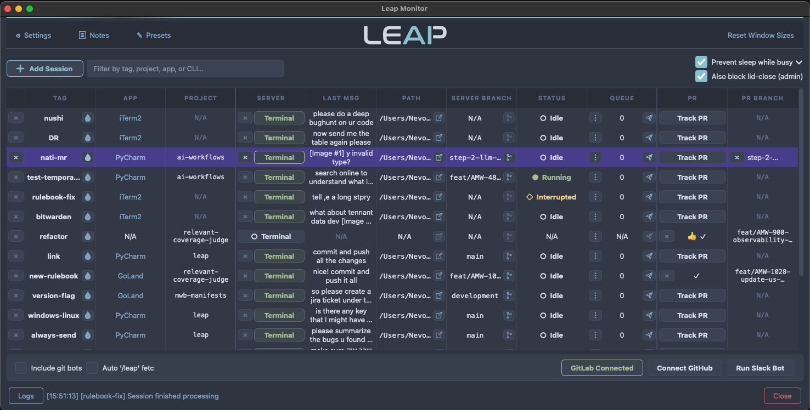

# Leap

**A queueing system and dashboard for managing multiple Claude CLI sessions.**

Run Claude Code in any terminal (JetBrains, VS Code, iTerm2, and more). Queue messages while Claude is busy, track all sessions from a single monitor, and jump straight to the right terminal with one click.

## Key Features

- **Smart message queueing** — Auto-sends when Claude is ready
- **Real-time GUI monitoring** — See all sessions, jump across IDEs and projects
- **PR tracking** — GitLab & GitHub thread detection with `/leap` command support
- **Slack integration** — Bidirectional messaging between Slack and Leap sessions

## Installation

**Platform:** macOS (full support). Linux works for core queueing and Slack, but the Monitor GUI is macOS only.

**Prerequisites:** Python 3.11+, [Claude Code CLI](https://docs.anthropic.com/en/docs/claude-code)

```bash
git clone https://github.com/nevo24/leap.git
cd leap
make install
source ~/.zshrc  # or ~/.bashrc
```

Already installed? Run `leap --update` to pull the latest version and rebuild.

### Upgrading from ClaudeQ

The project was renamed from **ClaudeQ** (`claudeq`) to **Leap** (`leap`). If you have an existing ClaudeQ installation:

```bash
cd ~/workspace/claudeq   # your existing repo
git pull                  # get the new code
cd ..
mv claudeq leap           # rename the directory
cd leap
make install              # runs migration + installs new 'leap' command
source ~/.zshrc           # activate the new shell config
```

This migrates your storage, hooks, shell config, and monitor app automatically. The old `cq` / `claudeq` commands are replaced by `leap`.

## Usage

Just run `leap <tag>` — that's it! Leap wraps your AI CLI with queueing and session tracking.

```bash
leap my-feature         # Select CLI (Claude/Codex), first run starts server
leap my-feature         # Second run connects a client (queue messages here)
leap                    # Interactive: choose CLI + session name
```

The **Monitor** is a native macOS app installed alongside Leap. Just open it from your Applications folder or Spotlight to see all your sessions at a glance:



## License

MIT License - see [LICENSE](LICENSE)

---

**Links:** [GitHub](https://github.com/nevo24/leap) • [Claude Code](https://docs.anthropic.com/en/docs/claude-code)
